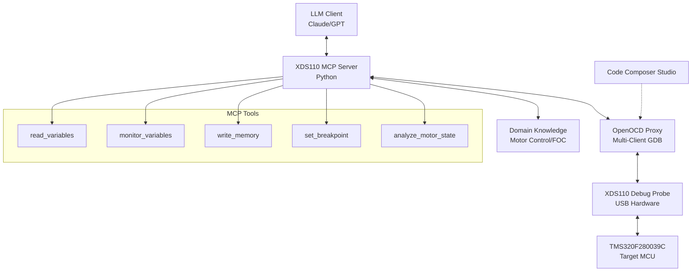

# XDS110 Universal Debugger - MCP Server
## Generic Debugging Interface for ANY Texas Instruments CCS Project

[](https://opensource.org/licenses/MIT)
[](https://www.python.org/downloads/)
[](https://modelcontextprotocol.io/)
[]()

> 🚀 **Zero-configuration debugging for ANY CCS project!** Auto-discovers 1000+ variables from MAP files, no hardcoding required.

---

## 🎯 Overview

A universal debugging solution that automatically discovers and monitors variables from ANY Texas Instruments Code Composer Studio project. Using MAP file parsing and TI's Debug Server Scripting (DSS), it provides generic access to all project symbols without any manual configuration.

### ✨ Key Features

- **Zero Configuration** - Just point at your CCS project directory
- **Auto-Discovery** - Parses MAP files to find ALL variables (1000+)
- **Pattern Search** - Find variables using regex patterns
- **Real-Time Monitoring** - Watch any variable change in real-time
- **MCP Protocol** - Integrates with LLMs as debugging co-pilots
- **Universal Support** - Works with C2000, MSP430, ARM-based TI MCUs

### 🔧 Verified Hardware
- TI XDS110 Debug Probe (and compatible)
- TMS320F280039C (C2000 series)
- MSP430 series (with DSS support)
- TI ARM Cortex-M devices
- Any CCS-supported target with MAP file generation

---

## Architecture Overview



### OpenOCD Multi-Client Proxy

Traditional debugging allows only one tool to connect to hardware. This solution uses OpenOCD's multi-client capabilities:

1. OpenOCD connects to XDS110 using native driver support
2. Multiple GDB clients can connect to OpenOCD simultaneously  
3. MCP server acts as intelligent GDB client for LLM interaction
4. Code Composer Studio can still connect when needed (via session handoff)

---

## Quick Start

### Prerequisites
- Python 3.8+
- OpenOCD with XDS110 driver support
- XDS110 debug probe with firmware 2.3.0.11+
- TI target hardware (F280039C verified)

### Installation
```bash
git clone https://github.com/yourusername/XDS110_MCP_server.git
cd XDS110_MCP_server
pip install -r requirements.txt
```

### Hardware Verification
```bash
# Check XDS110 detection
lsusb | grep "0451:bef3"
# Should show: Bus XXX Device XXX: ID 0451:bef3 Texas Instruments, Inc.

# Test OpenOCD connection
openocd -f configs/xds110_f28039.cfg
```

### Start MCP Server
```bash
# Start the MCP server
python -m xds110_mcp_server --config configs/f28039_config.json

# In another terminal, test with MCP Inspector
npx @modelcontextprotocol/inspector python -m xds110_mcp_server
```

---

## MCP Tools Available to LLMs

| Tool | Description | Parameters | Example Use |
|------|-------------|------------|-------------|
| `read_variables` | Read current values of motor control variables | `variable_list`, `format` | Monitor motor state, position, currents |
| `monitor_variables` | Continuous monitoring with change detection | `variables`, `duration`, `threshold` | Detect anomalies during motor operation |
| `write_memory` | Direct memory writes to structures | `address`, `value`, `size` | Modify debug_bypass parameters |
| `set_breakpoint` | Conditional breakpoints with custom logic | `address`, `condition`, `action` | Stop when motor state changes |
| `analyze_motor_state` | AI-powered motor control analysis | `focus_area` | Diagnose humming, faults, tuning issues |
| `calibrate_motor` | Trigger calibration sequences | `calibration_type` | Run commands 64-67 for motor setup |

### Example LLM Interactions

```
Human: "My PMSM motor hums instead of spinning during bypass alignment"

LLM: I'll help diagnose this motor humming issue. Let me start by monitoring 
the key variables during bypass alignment.

→ monitor_variables(['motorVars_M1.motorState', 'debug_bypass.bypass_alignment_called', 'motorVars_M1.Idq_out_A.value[0]'], duration=30)

I can see the bypass alignment is being called, but the D-axis current 
(Idq_out_A[0]) remains at 0. This suggests missing current control 
initialization. Let me check the debug_bypass structure...

→ read_variables(['debug_bypass.debug_enabled', 'debug_bypass.command.cmd'])

The debug_bypass.debug_enabled is 0. Let me enable it and set up proper 
current control initialization:

→ write_memory(0x0000d3c0, 1, 1)  # Enable debug bypass
→ write_memory(0x0000d3c5, 100, 2)  # Set 0.1A current limit

Now let's monitor if the motor behavior improves...
```

---

## Project Structure

```
XDS110_MCP_server/
├── README.md                          # This file
├── PRD.md                              # Product Requirements Document
├── LICENSE                             # MIT License
├── requirements.txt                    # Python dependencies
├── pyproject.toml                      # Python project configuration
│
├── xds110_mcp_server/                  # Main MCP server package
│   ├── __init__.py                     # Package initialization
│   ├── server.py                       # Main MCP server implementation
│   ├── tools/                          # MCP tool implementations
│   │   ├── __init__.py
│   │   ├── variable_monitor.py         # Variable reading/monitoring tools
│   │   ├── memory_tools.py             # Memory read/write tools
│   │   ├── breakpoint_tools.py         # Breakpoint management tools
│   │   └── analysis_tools.py           # Motor analysis and diagnostics
│   ├── gdb_interface/                  # GDB protocol communication
│   │   ├── __init__.py
│   │   ├── gdb_client.py              # GDB protocol implementation
│   │   └── openocd_manager.py         # OpenOCD process management
│   ├── knowledge/                      # Domain knowledge database
│   │   ├── __init__.py
│   │   ├── motor_control.py           # Motor control expertise
│   │   ├── ti_peripherals.py          # TI peripheral knowledge
│   │   └── fault_patterns.py          # Common failure pattern recognition
│   └── utils/                          # Utility functions
│       ├── __init__.py
│       ├── config.py                  # Configuration management
│       ├── logging.py                 # Logging setup
│       └── hardware_detect.py         # Hardware detection utilities
│
├── configs/                            # Configuration files
│   ├── xds110_f28039.cfg             # OpenOCD configuration for F280039C
│   ├── f28039_config.json            # Default server configuration
│   └── motor_variables.json          # Motor control variable definitions
│
├── legacy_ti_debugger/                 # Copied from working implementation
│   ├── framework/
│   │   └── ti_dss_adapter.py          # Proven TI DSS connection logic
│   ├── working_memory_motor_control.py # Working motor control script
│   ├── motor_control.py               # Clean entry point
│   └── js_scripts/                    # JavaScript DSS debugging scripts
│       ├── connect_target_v2.js
│       ├── read_motor_vars_v1.js
│       └── monitor_alignment.js
│
├── tests/                              # Test suite
│   ├── __init__.py
│   ├── test_mcp_server.py             # MCP server tests
│   ├── test_gdb_interface.py          # GDB interface tests
│   ├── test_hardware_integration.py   # Hardware integration tests
│   └── fixtures/                      # Test fixtures and mock data
│
├── docs/                               # Documentation
│   ├── installation.md                # Installation guide
│   ├── configuration.md               # Configuration documentation
│   ├── api_reference.md               # MCP API reference
│   ├── troubleshooting.md             # Common issues and solutions
│   └── examples/                      # Usage examples
│       ├── basic_debugging.md
│       ├── motor_tuning.md
│       └── advanced_analysis.md
│
└── scripts/                            # Utility scripts
    ├── setup_openocd.sh              # OpenOCD installation helper
    ├── test_hardware.py              # Hardware connection test
    └── validate_installation.py       # Installation validation
```

---

## Development Status

### Completed (From Legacy ti_debugger)
- [x] **Hardware Connection**: XDS110 + F280039C proven working
- [x] **Memory Access**: Direct read/write to debug_bypass structure (0x0000d3c0)
- [x] **Variable Reading**: Comprehensive motor control variable access
- [x] **Motor Control**: PMSM motor control with DRV8323RH driver
- [x] **Calibration**: Automated calibration sequences (commands 64-67)
- [x] **Domain Knowledge**: Motor control, FOC principles, fault patterns

### In Progress
- [ ] **MCP Server Implementation**: Converting ti_debugger logic to MCP framework
- [ ] **OpenOCD Integration**: Multi-client GDB proxy setup
- [ ] **Tool Development**: MCP tools for variable monitoring, memory access
- [ ] **LLM Integration**: Domain knowledge integration for intelligent analysis

### Planned
- [ ] **Session Management**: CCS handoff and conflict resolution
- [ ] **Advanced Analysis**: Pattern recognition and fault diagnosis
- [ ] **Performance Optimization**: Sub-100ms variable read latency
- [ ] **Documentation**: Comprehensive guides and API reference
- [ ] **Testing**: Hardware integration and reliability tests

---

## Use Cases

### 1. Motor Humming Diagnosis 
**Problem**: PMSM motor hums during bypass alignment instead of spinning smoothly.
**Solution**: LLM analyzes bypass alignment variables, identifies missing current control initialization, and suggests memory writes to fix the issue.

### 2. Real-Time Debugging Assistant
**Problem**: Complex motor control sequences with dozens of variables to monitor.
**Solution**: LLM continuously monitors variables, detects anomalies, and provides contextual alerts with domain expertise.

### 3. Interactive Parameter Tuning
**Problem**: PID controller tuning requires iterative testing and analysis.
**Solution**: LLM suggests parameter changes based on motor behavior description, applies changes via memory writes, and monitors results.

### 4. Automated Fault Analysis
**Problem**: Intermittent overcurrent faults that are difficult to debug manually.
**Solution**: LLM sets intelligent breakpoints, monitors fault conditions, and analyzes patterns to identify root causes.

---

## Technical Specifications

### Performance Requirements
- **Variable Read Latency**: < 100ms per variable
- **Monitoring Frequency**: Up to 10Hz for critical variables  
- **Memory Footprint**: < 50MB RAM usage
- **Startup Time**: < 5 seconds to ready state
- **Connection Recovery**: Auto-reconnect within 1 second

### Hardware Requirements
- **Debug Probe**: XDS110 with firmware 2.3.0.11+
- **Target MCU**: TMS320F280039C (F28xx series support planned)
- **Connection**: USB 2.0+ for XDS110 probe
- **Host OS**: Linux (tested), Windows/macOS (planned)

### Software Requirements
- **Python**: 3.8+ with asyncio support
- **OpenOCD**: Latest version with XDS110 driver
- **MCP SDK**: Python Model Context Protocol SDK
- **Optional**: Code Composer Studio for traditional debugging

---

## Contributing

We welcome contributions to this embedded systems debugging MCP server:

### High-Priority Areas
- Additional TI MCU support (F28xx series, C2000 family)
- Other debug probe support (J-Link, ST-Link)
- Windows/macOS compatibility
- Advanced motor control algorithms
- Performance optimizations

### Getting Started
1. Fork the repository
2. Set up development environment: `pip install -r requirements-dev.txt`
3. Run tests: `pytest tests/`
4. Submit pull request with comprehensive testing

### Development Guidelines
- Follow PEP 8 style guidelines
- Add tests for new functionality  
- Update documentation for user-facing changes
- Verify hardware compatibility before submitting

---

## Resources & References

### MCP Protocol
- [Model Context Protocol Documentation](https://modelcontextprotocol.io/)
- [MCP Python SDK](https://github.com/modelcontextprotocol/python-sdk)
- [MCP Inspector Tool](https://modelcontextprotocol.io/legacy/tools/inspector)

### OpenOCD & Hardware  
- [OpenOCD User's Guide](https://openocd.org/doc/html/)
- [XDS110 Debug Probe Guide](https://software-dl.ti.com/ccs/esd/documents/xdsdebugprobes/emu_xds110.html)
- [OpenOCD XDS110 Driver](https://github.com/openocd-org/openocd/blob/master/src/jtag/drivers/xds110.c)

### TI Documentation
- [F280039C Technical Reference](https://www.ti.com/lit/pdf/sprui94)
- [Code Composer Studio Debug Guide](https://software-dl.ti.com/ccs/esd/documents/users_guide_ccs_20.2.0/ccs_debug-main.html)
- [TI E2E Community - XDS110 + OpenOCD](https://e2e.ti.com/support/tools/code-composer-studio-group/ccs/f/code-composer-studio-forum/630450/tms570ls3137-using-xds110-with-gdb-openocd)

---

## License

MIT License - see [LICENSE](LICENSE) file for details.

---

## Acknowledgments

- Texas Instruments: For XDS110 debug probe and comprehensive documentation
- OpenOCD Project: For multi-client debugging architecture  
- Model Context Protocol Team: For the MCP framework enabling LLM tool integration
- Embedded Community: For sharing knowledge and debugging techniques